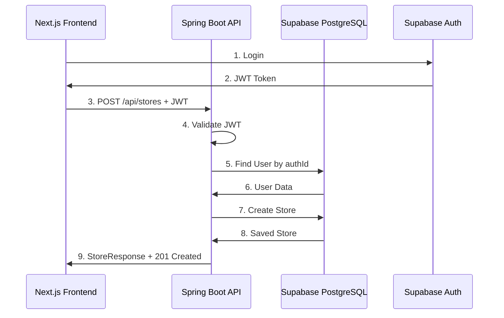

# Store API Implementation Summary

## ✅ Completed Components

### 1. Domain Models

#### User Entity
**File**: [User.java](file:///c:/Users/INSIDER/Desktop/My%20Library/Websites/zetumall-backend/src/main/java/com/zetumall/user/User.java)

Mapped from Prisma `User` model with key fields:
- `id` (CUID) - Primary key
- `authId` - Links to Supabase Auth UUID
- `name`, `email`, `image`
- `role` (BUYER, SUPPLIER, ADMIN)
- `country`, `currency`
- `isActive`, `banReason`
- Seller metrics (`sellerRating`, `totalSales`, etc.)

#### Store Entity
**File**: [Store.java](file:///c:/Users/INSIDER/Desktop/My%20Library/Websites/zetumall-backend/src/main/java/com/zetumall/store/Store.java)

Complete mapping from Prisma `Store` model with:
- Basic info (`name`, `username`, `description`, `email`, `contact`)
- Status management (`status`, `isActive`)
- Subscription (`subscriptionPlan`, `subscriptionExpiresAt`)
- Trust & safety (`trustScore`, `trustLevel`, `riskLevel`)
- AI metadata (`aiGenerated`, `bannerPrompt`)
- Policies (`shippingPolicy`, `returnPolicy`, `compliancePolicy`)
- Customization (`customBanner`, `customTheme`)
- Payment (`mpesaNumber`, `paymentMethods`)

### 2. Repositories

#### UserRepository
**File**: [UserRepository.java](file:///c:/Users/INSIDER/Desktop/My%20Library/Websites/zetumall-backend/src/main/java/com/zetumall/user/UserRepository.java)

Query methods:
- `findByAuthId(String authId)` - Find by Supabase Auth ID
- `findByEmail(String email)`
- `existsByEmail(String email)`

#### StoreRepository
**File**: [StoreRepository.java](file:///c:/Users/INSIDER/Desktop/My%20Library/Websites/zetumall-backend/src/main/java/com/zetumall/store/StoreRepository.java)

Query methods:
- `findByUserId(String userId)` - Get user's store
- `findByUsername(String username)`
- `existsByUsername(String username)` - Check availability
- `findByStatus(StoreStatus status)` - Filter by status
- `findByUserIdAndStatus(...)` - Combined filter

### 3. DTOs (Data Transfer Objects)

#### StoreCreateRequest
**File**: [StoreCreateRequest.java](file:///c:/Users/INSIDER/Desktop/My%20Library/Websites/zetumall-backend/src/main/java/com/zetumall/store/dto/StoreCreateRequest.java)

Request body for creating/updating stores with:
- Required fields (`name`, `username`, `description`, `email`, `contact`, `address`)
- Optional fields (`logo`, `customBanner`, `category`)
- AI fields (`tagline`, `policies`, `bannerPrompt`)
- Payment (`mpesaNumber`, `paymentInfo`)

#### StoreResponse
**File**: [StoreResponse.java](file:///c:/Users/INSIDER/Desktop/My%20Library/Websites/zetumall-backend/src/main/java/com/zetumall/store/dto/StoreResponse.java)

Response format with:
- Public store information
- Static `fromEntity(Store)` converter method
- Excludes sensitive data

### 4. Business Logic

#### StoreService
**File**: [StoreService.java](file:///c:/Users/INSIDER/Desktop/My%20Library/Websites/zetumall-backend/src/main/java/com/zetumall/store/StoreService.java)

Business methods:
1. **`createStore(...)`**:
   - Validates user exists and role
   - Checks for existing stores
   - Validates username uniqueness
   - Auto-approves stores (MVP mode)
   - Updates user role to SUPPLIER
   - Grants 6-month free trial

2. **`getStoreByUserId(...)`** - Fetch user's store

3. **`getStoreById(...)`** - Fetch by store ID

4. **`updateStore(...)`**:
   - Verifies ownership
   - Updates specified fields only
   - Preserves unchanged data

5. **`getAllStores()`** - List all stores

6. **`getStoresByStatus(...)`** - Filter by status

### 5. REST API Controller

#### StoreController
**File**: [StoreController.java](file:///c:/Users/INSIDER/Desktop/My%20Library/Websites/zetumall-backend/src/main/java/com/zetumall/store/StoreController.java)

**Endpoints**:

| Method | Endpoint | Description | Auth Required |
|--------|----------|-------------|---------------|
| POST | `/api/stores` | Create new store | ✅ |
| GET | `/api/stores/me` | Get current user's store | ✅ |
| GET | `/api/stores/:id` | Get store by ID | ✅ |
| PUT | `/api/stores/:id` | Update store | ✅ |
| GET | `/api/stores?status=...` | List stores (filter optional) | ❌ |

**Error Handling**:
- `400 Bad Request` - Validation errors, duplicates
- `401 Unauthorized` - Missing/invalid JWT
- `404 Not Found` - Store doesn't exist
- `500 Internal Server Error` - Unexpected errors

---

## 🔥 Key Features Implemented

### Auto-Approval (MVP Mode)
Stores are automatically approved and activated upon creation:
```java
store.setStatus(Store.StoreStatus.APPROVED);
store.setIsActive(true);
store.setSubscriptionExpiresAt(LocalDateTime.now().plusMonths(6));
```

This simplifies MVP development. In production, you'd integrate with:
- AI governance checks
- Manual admin approval workflow
- Payment verification

### Role Management
Automatically upgrades user to `SUPPLIER` role when creating a store:
```java
if (user.getRole() != User.Role.SUPPLIER) {
    user.setRole(User.Role.SUPPLIER);
    userRepository.save(user);
}
```

### Username Validation
Checks uniqueness before creating:
```java
if (storeRepository.existsByUsername(request.getUsername())) {
    throw new RuntimeException("Username already taken");
}
```

### Authentication Integration
Uses Supabase JWT from request headers:
```java
@AuthenticationPrincipal SupabaseAuthenticatedUser authUser
```

The filter extracts user info from the token automatically.

---

## 📊 API Flow Diagram



---

## 🧪 Testing Guide

See [TESTING.md](file:///c:/Users/INSIDER/Desktop/My%20Library/Websites/zetumall-backend/TESTING.md) for:
- cURL examples for each endpoint
- Expected responses
- Error scenarios
- Postman/Thunder Client setup

---

## 📈 Progress

**Completed (Phase 3)**:
- [x] User entity
- [x] Store entity
- [x] Repositories (User, Store)
- [x] DTOs (StoreCreateRequest, StoreResponse)
- [x] StoreService with full CRUD
- [x] StoreController with 5 endpoints
- [x] Testing documentation

**Next Steps**:
- [ ] Product entity and APIs
- [ ] File upload integration (Supabase Storage)
- [ ] Order & Escrow entities
- [ ] Integration with Python AI service
- [ ] Admin approval workflow

**Overall Progress**: ~25% of backend migration complete

---

## 🚀 How to Run

1. **Configure environment**:
   ```bash
   copy .env.example .env
   # Fill in Supabase credentials
   ```

2. **Build & run**:
   ```bash
   gradlew.bat bootRun
   ```

3. **Test health endpoint**:
   ```bash
   curl http://localhost:8080/api/health
   ```

4. **Test store creation**:
   - Get JWT token from Supabase Auth (via Next.js login)
   - Use cURL or Postman to POST to `/api/stores`
   - See [TESTING.md](file:///c:/Users/INSIDER/Desktop/My%20Library/Websites/zetumall-backend/TESTING.md) for details

---

## 🎯 What's Working

✅ Spring Boot starts successfully  
✅ Database connection to Supabase PostgreSQL  
✅ JWT authentication filter validates tokens  
✅ CORS allows Next.js requests  
✅ Health endpoint returns status  
✅ Store creation endpoint functional  
✅ Store retrieval by user/ID working  
✅ Store update with ownership validation  
✅ Store listing with status filtering  

---

## 📝 Notes

### Database Schema
No migrations needed - using existing Prisma schema:
- Tables: `"User"`, `"Store"` (note the quotes for case-sensitive names)
- Schema: `public`
- Connection: Pooled via port 6543

### Error Handling
All endpoints return consistent `ApiResponse` format:
```json
{
  "success": true/false,
  "message": "...",
  "data": {...} or null,
  "error": null or {...}
}
```

### Authentication
- Public endpoints: `/api/health`, `/api/public/**`
- Protected endpoints: Everything else
- Admin endpoints: `/api/admin/**` (requires `ROLE_ADMIN`)

---

## 🔜 Immediate Next Tasks

1. **Test with Real Data**:
   - Set up `.env` with Supabase credentials
   - Run the application
   - Create a test store via API
   - Verify in Supabase database

2. **Implement Product APIs**:
   - Create Product entity
   - ProductRepository
   - ProductService
   - ProductController

3. **File Upload**:
   - Integrate Supabase Storage client
   - Handle logo/banner uploads
   - Return public URLs

4. **Frontend Integration**:
   - Create API client in Next.js
   - Update store creation flow
   - Point to Spring Boot backend

Let me know when you're ready to proceed! 🚀
